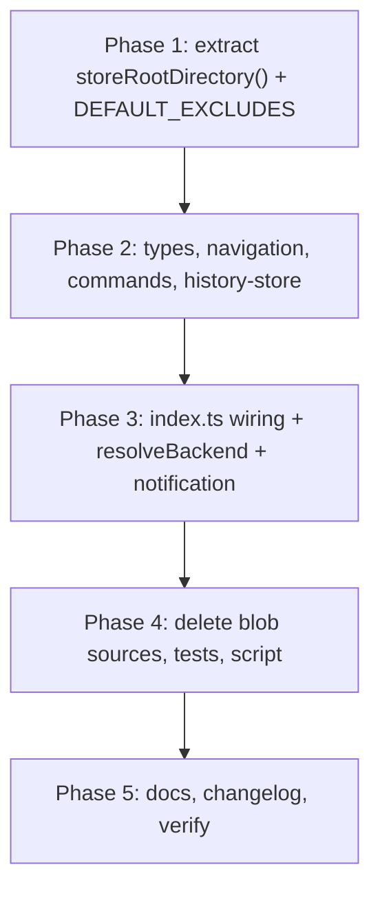

# Plan: Consolidate to Git-Only Engine & Retire Custom BlobStore

## 1. Problem Statement: Architectural Duplication

`@baylarsadigov/omp-undo-redo` maintains **two independent snapshot subsystems**:

1. **Git / Private-Git Engine** (`src/core/checkpoints.ts`, `src/core/private-repo.ts`, `src/core/git-runner.ts`):
   - Git object storage (`.git/objects`), `git write-tree`, refs under `refs/omp-undo-redo/`, index leasing (`SnapshotIndexLease`).
   - Non-Git workspaces get an isolated repository at `<storeRoot>/repos/<sha256(cwd)>.git` and run the same engine.
   - GC delegated to native `git gc --prune=now`.

2. **Custom JavaScript BlobStore** (`src/core/blob-store/*`, `src/core/blob-checkpoints.ts`, `src/core/blob-history-store.ts`):
   - 2,858 LOC source / 2,411 LOC tests of hand-rolled content-addressed storage.
   - Re-implements cross-process locking (`locks.ts`), lease/liveness tracking (`liveness.ts`), directory crawling + stat caching (`walk.ts`), write-ahead logging with rollback (`mutator.ts`), refcounting (`refs.ts`), byte-cap accounting (`accounting.ts`), mark-and-sweep GC (`gc.ts`).

### Why this is redundant

- `OMP_UNDO_REDO_PRIVATE_GIT` defaults to `1`, so non-Git workspaces already use Private-Git. BlobStore runs only when the Git binary is missing, or when a user explicitly sets `PRIVATE_GIT=0`.
- Two engines double the test matrix and the failure surface for one product behavior.
- `CHANGELOG.md:86` already shipped the data-loss consequence of this direction in 1.5.0: _"Existing blob-mode session history … is not visible through the new backend."_

### Accepted regression (state it plainly, do not dress it as a mitigation)

On a machine **without a Git binary**, file restore disappears entirely. Today `git_unavailable` + no `.git` marker in ancestors falls back to BlobStore (`src/index.ts:241-254`) and restores files. After this change that path is `kind: "session"` — session navigation only, no file restore, ever. The premise that permits this: OMP/Pi users are engineers with Git installed. Document in CHANGELOG as a breaking change, not as a "graceful fallback".

---

## 2. Goal

- **Single Git-based architecture:**
  - Git workspace → existing `.git` via custom refs.
  - Non-Git workspace → Private-Git under `<storeRoot>/repos/`, unconditionally.
  - No Git binary, or Private-Git init failure → `kind: "session"` with one notification.
- **Delete the BlobStore** and everything that exists only to serve it.
- **Rename `OMP_UNDO_REDO_BLOB_DIR` → `OMP_UNDO_REDO_STORE_DIR`**, keep the old name as a permanent one-line alias (`??`). No deprecation warning, no removal timeline.
- **Remove `OMP_UNDO_REDO_MAX_STORE_MB`** and **`OMP_UNDO_REDO_PRIVATE_GIT`** (both breaking).
- **Do not build a migration for legacy blob history.** See §4.

Budget: delete ~5,270 LOC, add ~40. Any addition beyond that needs a named user complaint behind it.

---

## 3. Scope of Changes

### A. Files to Delete (5,269 LOC source+test)

**Source (2,858):** `src/core/blob-store/` — `accounting.ts` (94), `fs.ts` (138), `gc.ts` (262), `index.ts` (466), `liveness.ts` (221), `locks.ts` (194), `manifest.ts` (89), `mutator.ts` (465), `refs.ts` (193), `types.ts` (60), `walk.ts` (215); plus `src/core/blob-checkpoints.ts` (122), `src/core/blob-history-store.ts` (339).

**Tests (2,411):** `test/blob-store.test.ts` (991), `test/blob-expiration.test.ts` (770), `test/blob-history-store.test.ts` (577), `test/blob-checkpoints.test.ts` (73).

**Scripts:** `scripts/bench-walk.mjs` (+ `"bench:walk"` in `package.json`).

### B. Files to Modify

#### 1. `src/core/types.ts`

- Remove `BlobCheckpoint` (116–125) and `PendingBlobCheckpoint` (151–158).
- Remove `"before_blob_failed"`, `"after_blob_failed"`, `"blob_apply_failed"` from `FileCheckpointUnavailableReason`.
- **Add** `"private_repository_unavailable"` — non-Git workspace eligible for Private-Git, but `resolvePrivateGit()` returned null. Replaces the misleading `not_repository`/blob fallback in that path.
- Remove `{ status: "blob_failed" }` from `NavigationResult` (line 46).
- Narrow: `export type TurnCheckpoint = GitCheckpoint | SessionOnlyCheckpoint;` and `export type PendingTurnCheckpoint = PendingGitCheckpoint | PendingSessionCheckpoint;`

**Not added:** `legacy_snapshot_unavailable`. Nothing emits it once §4 is dropped.

#### 2. `src/core/session-navigation.ts`

- Drop `BlobCheckpoint` import; drop `BlobApplyResult`/`BlobStore` imports from `./blob-store/index.js`.
- Remove `CheckpointApplier.blob`, `CheckpointReleaser.blob`, `blobShouldReleaseOnSuspend`.
- Delete `blobNavigationApplier()` / `blobNavigationReleaser()` (43–67).
- Remove blob constructor defaults (95, 100–101) and the optional `applier`/`releaser` blob params.
- Remove `this.releaser.blob(...)` in `releaseFileCheckpoints()` (198).
- `convertEarlierFileCheckpoints()` return type → `GitCheckpoint[]`.
- Remove blob branch in `applyFileCheckpoint()` (268–275).
- `performUndo()` (301) / `performRedo()` (332): drop the `kind === "blob" ? "blob_failed" : "git_failed"` ternaries → always `"git_failed"`.
- `suspend()` (234–251): drop blob filtering and release.

#### 3. `src/index.ts`

- Remove imports from `blob-store/index.js`, `blob-checkpoints.js`, `blob-history-store.js`, and the two blob navigation factories.
- Replace `blobStoreRootDirectory()` with `storeRootDirectory()` at every call site: `startPrivateRepo` (167), `cleanLegacyGitIndexes` (375), `evictStalePrivateRepos` (481).
- **`FileBackend`** — two variants, no extra fields:
  ```ts
  export type FileBackend =
    | { kind: "git"; repository: GitRepository; git: GitRunner }
    | { kind: "session"; reason: FileCheckpointUnavailableReason };
  ```
- **`resolveBackend()`** — drop `blobStoreFor` and `privateGitEnabled` params; delete `hasGitMarkerInAncestors()` (144–157) and the `realpath(cwd)` → blob tail (251–257). `resolveRepository` can only return `git_unavailable | not_repository | repository_unresolvable` (`src/core/checkpoints.ts:86`), so the whole tree is:
  ```ts
  const git = gitRunnerFactory(cwd);
  const resolved = await resolveRepository(git);
  if ("repository" in resolved) {
    /* unchanged: cache by commonDir, return kind:"git" */
  }
  if (resolved.reason !== "not_repository") return { kind: "session", reason: resolved.reason };
  const priv = await resolvePrivateGit(cwd, git, privateRepositories, gitRunnerFactory);
  return priv
    ? { kind: "git", repository: priv.repository, git: priv.git }
    : { kind: "session", reason: "private_repository_unavailable" };
  ```
- `readRetentionConfig()`: drop `maxStoreBytes` / `OMP_UNDO_REDO_MAX_STORE_MB`. Its only consumer is the blob `expireAndCollect` call at 626–630.
- Delete `privateGitEnabled` (302) outright. No residual read, no deprecation warning.
- Delete `blobStores` map (320) and `blobStoreFor()` (620–653), including its expiration-promise wiring.
- `createNavigation()`: drop `blobDependencies` (273–279, 295–296).
- `initializeNavigation()`: the `store` ternary (696–701) loses its `BlobHistoryStore` arm.
- `releasePending()` (799–803), `beginCapture()` (988–999), `finalizeTurn()` else-block (1130–1171), heartbeat blob branch (613–614), shutdown blob GC (1259–1264): remove.
- **One notification.** Reuse the existing shape at 716–736 (`ctx.ui?.notify(msg, "warning")`), gated by a per-session `Set<string>` of already-notified reasons:
  - `git_unavailable` → `"Git is not available.\nSession navigation still works, but file changes cannot be restored."`
  - `private_repository_unavailable` → `"The private snapshot repository could not be initialized.\nSession navigation still works, but file changes cannot be restored."`
  - `repository_unresolvable` → `"The Git repository could not be resolved.\nSession navigation still works, but file changes cannot be restored."`

  No `not_repository` wording: that reason can no longer reach `kind: "session"` (it routes to Private-Git; failure surfaces as `private_repository_unavailable`).

#### 4. `src/core/private-repo.ts`

- Remove `import { DEFAULT_BLOB_IGNORES } from "./blob-store/types.js"` (line 5); inline the same list locally as `DEFAULT_EXCLUDES`.
- Add `storeRootDirectory()`, moved from `blobStoreRootDirectory()` with one extra `??`:
  ```ts
  export function storeRootDirectory(): string {
    const explicit = process.env.OMP_UNDO_REDO_STORE_DIR ?? process.env.OMP_UNDO_REDO_BLOB_DIR;
    if (explicit) return canonicalCwdSync(explicit);
    if (process.env.OMP_UNDO_REDO_RUNTIME_DIR) {
      const runtime = resolve(process.env.OMP_UNDO_REDO_RUNTIME_DIR);
      return canonicalCwdSync(basenameIsRuntime(runtime) ? dirname(runtime) : runtime);
    }
    return canonicalCwdSync(join(homedir(), ".omp", "omp-undo-redo"));
  }
  ```
  `OMP_UNDO_REDO_BLOB_DIR` stays readable permanently. It costs three words; a removal timeline costs a release note and a breakage.
- `ensurePrivateGitRepository()` signature unchanged (`Promise<GitRepository | null>`). No `created` flag: nothing consumes it once the first-use notification is out of scope (§6).

#### 5. `src/commands/undo.ts`, `src/commands/redo.ts`

- Drop `before_blob_failed` / `after_blob_failed` / `blob_apply_failed` from `unavailableMessage()`.
- Add `case "private_repository_unavailable": return "the private snapshot repository could not be initialized.";`
- Drop `case "blob_failed"` from the outcome switch (82–89).

#### 6. `src/core/history-store.ts`

- `UNAVAILABLE_REASONS`: remove the three blob entries (42–44), add `private_repository_unavailable: true`.
- **No `parseHistory()` blob guard.** Blob checkpoints were only ever written by `BlobHistoryStore` to `<storeRoot>/history/`; `parseHistory()` reads `<gitDir>/omp-undo-redo/history/` and additionally gates on `sameRepository()` (168). A `kind:"blob"` entry cannot reach it.

#### 7. Comment-only cleanups

- `src/core/history-liveness.ts:8` and `src/core/prune-tombstones.ts:7` reference "blob store root" — reword. `prune-tombstones.ts` now has a single consumer; leave the module as is (it is already minimal).

#### 8. Tests referencing removed wiring

- `test/private-repo.test.ts`: drop `BlobStore` import and `blobStoreStub()`; drop `blobStoreFor`/`privateGitEnabled` args from `resolveBackend()` calls; retarget assertions:
  - `"falls back to blob when private git is disabled"` → Private-Git is unconditional → assert `kind: "git"`.
  - `"falls back to blob when private repo init fails"` → assert `kind: "session"`, `reason: "private_repository_unavailable"`.
  - `"seeds the built-in blob ignores"` → assert against `DEFAULT_EXCLUDES` (same list).
- `test/bounded-capture.test.ts:12` and `test/private-gc.test.ts:12,37-43` set `OMP_UNDO_REDO_BLOB_DIR`. The permanent alias keeps them green; switch them to `OMP_UNDO_REDO_STORE_DIR` for consistency in the same pass.

---

## 4. Legacy Blob History: No Migration

**Decision: do nothing.** A former blob-mode session resolves to Private-Git, `SessionHistoryStore.load()` returns `{status:"unavailable", reason:"missing"}`, and `initializeNavigation()` falls through to `reconstructSessionHistory(ctx.sessionManager)` (`src/index.ts:740`).

Why that is sufficient:

- `reconstructSessionHistory()` (`src/core/history-store.ts:211`) already emits one session-only checkpoint per completed turn on the active branch. A migrated blob checkpoint degrades to the same `kind:"session"` shape — file content is unrestorable either way. The only delta is the persisted `currentIndex` and a different `reason` string.
- The loss is already shipped and documented for the default path since 1.5.0 (`CHANGELOG.md:86`).
- Remaining affected population: users who set `PRIVATE_GIT=0` **and** resume within `OMP_UNDO_REDO_RETENTION_DAYS` (default 2). Older blob history is already tombstoned by retention.
- A migration reader would have to re-implement tombstone checks, the 4 MiB size guard, canonical-workspace comparison, and session-tree leaf validation — all from the `BlobHistoryStore` being deleted — plus private copies of the `BlobCheckpoint` shape that Phase 2 removes, plus save-before-restore ordering, plus ~350 LOC of tests. ~600 LOC to preserve an undo cursor position.

Existing behavior already covers the user-visible part: an unusable/missing history load reconstructs turns and the user gets the standard warning path (`src/index.ts:729-736`).

Revisit only if a user reports losing a resumable non-Git session; then the cheapest fix is a ~40-line reader with no notification and no new reason string.

### Legacy blob data on disk: leave it

- `blobs/`, `trees/`, `leases/`, `journals/`, `history/` under the store root become inert.
- Do **not** auto-delete: an older OMP process may still be running against them during upgrade, and no locking/liveness code survives to coordinate. The store root also contains `repos/` — broad cleanup there is a snapshot-loss risk.
- A future versioned cleanup can remove them after confirming >30 days untouched.

---

## 5. Storage Cap Removal

`OMP_UNDO_REDO_MAX_STORE_MB` is removed. Mechanical: its only consumer is `store.expireAndCollect(retentionDays, maxStoreBytes, …)` at `src/index.ts:630`. Git mode never had a byte cap, so **git-workspace users see no change**; the exposure is Private-Git, which has been the non-Git default since 1.5.0.

**What remains:** retention-by-age (`OMP_UNDO_REDO_RETENTION_DAYS`, default 2) expires dormant sessions and deletes their refs; private-repo eviction removes repos whose workspace disappeared (24 h idle + 7-day trash).

**What does not exist:** any byte-based cap, in user repos or private repos. Prompt reclamation happens only where the extension runs GC — private repos, via `git gc --prune=now` every 20 captures and at shutdown. User repositories are never GC'd by this extension.

**Worst case to document:** heavy generated artifacts, e.g. 200 MiB changed/turn × 30 turns/day × 2 days ≈ 12 GiB retained in a private repo until expiry. Retention is time-bounded, not byte-bounded.

**Also removed with the BlobStore:** the 16 MiB per-file limit (`maxFileBytes`). Files above it were silently skipped by blob snapshots; `git add -A` captures them. Larger snapshots and slower captures for workspaces with big generated files. CHANGELOG it.

Optional, only if growth is reported: one `git count-objects -v` at the existing 20-capture GC hook plus a single warning. ~5 lines. **Do not build a quota system.**

---

## 6. Breaking Changes

1. **`OMP_UNDO_REDO_PRIVATE_GIT` removed.** Non-Git workspaces always use Private-Git. Setting `=0` has no effect — the variable is simply gone, no warning path. Note in release notes that `=0` never meant "don't persist my files": BlobStore also copied content under the store root; only the storage format changes.
2. **`OMP_UNDO_REDO_MAX_STORE_MB` removed** (§5).
3. **No Git binary → no file restore** (§1, accepted regression).
4. **16 MiB per-file capture limit removed** (§5).
5. **`OMP_UNDO_REDO_BLOB_DIR` → `OMP_UNDO_REDO_STORE_DIR`**, old name still honored indefinitely. Not breaking.
6. **Forward/backward compat of history files:** `private_repository_unavailable` will appear in persisted history JSON. An older extension version validates `reason in UNAVAILABLE_REASONS` (`src/core/history-store.ts:120`) and will reject such a file as `unusable`, degrading that session to session-only navigation. One CHANGELOG line; no code.

**First-use Private-Git disclosure is out of scope.** Private-Git has been the non-Git default since 1.5.0 without it, and wiring a `created` flag through `ensurePrivateGitRepository()` → `startPrivateRepo()` → `resolvePrivateGit()` → `FileBackend` → a process-level `Set` costs a type change in four places for an info message. If disclosure is wanted, it belongs in README next to the store-root docs.

---

## 7. Implementation Sequence



### Phase 1 — break the dependency edge

- Add `storeRootDirectory()` to `src/core/private-repo.ts`; inline `DEFAULT_EXCLUDES`; drop the `./blob-store/types.js` import (line 5).
- Repoint the three `blobStoreRootDirectory()` call sites in `index.ts` (167, 375, 481).

Ordering is load-bearing: `private-repo.ts` imports from `blob-store/` today, so this must precede Phase 4.

### Phase 2 — types and consumers

- `src/core/types.ts`: remove blob checkpoint types, blob reasons, `blob_failed`; add `private_repository_unavailable`; narrow the two unions.
- `src/core/session-navigation.ts`: remove all blob interfaces, factories, branches, params.
- `src/commands/{undo,redo}.ts`: swap blob cases for `private_repository_unavailable`.
- `src/core/history-store.ts`: fix `UNAVAILABLE_REASONS` only.

### Phase 3 — `src/index.ts`

- Remove blob imports, `FileBackend` blob variant, `blobStores`, `blobStoreFor()`, blob GC/expiration/heartbeat branches, `privateGitEnabled`, `maxStoreBytes`.
- Rewrite `resolveBackend()` per §3.3; delete `hasGitMarkerInAncestors()`.
- Simplify `createNavigation()`, `releasePending()`, `beginCapture()`, `finalizeTurn()`, and the `store` ternary.
- Add the single session-only notification with the per-session reason `Set`.
- Update `test/private-repo.test.ts`, `test/bounded-capture.test.ts`, `test/private-gc.test.ts` per §3.8.

### Phase 4 — delete

- `src/core/blob-store/`, `src/core/blob-checkpoints.ts`, `src/core/blob-history-store.ts`.
- `test/blob-store.test.ts`, `test/blob-expiration.test.ts`, `test/blob-history-store.test.ts`, `test/blob-checkpoints.test.ts`.
- `scripts/bench-walk.mjs` + `package.json` script entry.

Every intermediate state compiles because Phases 1–3 already redirected all imports.

### Phase 5 — docs and verification

- `README.md:85` (16 MiB / symlink paragraph), `:93-135` (entire `RETENTION_DAYS` × `MAX_STORE_MB` configuration section, including the interaction table and the `MAX_STORE_MB` shell/PowerShell/`setx` examples), `:149` ("four modes" paragraph → Git mode, Private-Git mode, session-only fallback; `OMP_UNDO_REDO_BLOB_DIR` → `OMP_UNDO_REDO_STORE_DIR`).
- State that retention-by-age is the sole storage limit and is not a byte limit.
- `CHANGELOG.md`: the six items in §6.
- `npm run verify` (typecheck + lint + test).

---

## 8. Test Changes

Only contracts that can actually break get a test.

| Contract                                                                                  | Test                                                                                                                                                                                                                                                                                                |
| :---------------------------------------------------------------------------------------- | :-------------------------------------------------------------------------------------------------------------------------------------------------------------------------------------------------------------------------------------------------------------------------------------------------- |
| Git workspace: snapshot, undo, redo, custom refs                                          | Existing `test/checkpoints.test.ts`, `test/lifecycle.test.ts`                                                                                                                                                                                                                                       |
| Non-Git workspace: Private-Git snapshot/undo/redo, no `.git` in workspace                 | Existing `test/private-repo.test.ts` (blob-disabled case becomes the unconditional case)                                                                                                                                                                                                            |
| Private-Git init failure → `kind: "session"` + `private_repository_unavailable`           | Rewritten in `test/private-repo.test.ts` (was the blob-fallback assertion)                                                                                                                                                                                                                          |
| No Git binary → `kind: "session"`, `git_unavailable`, session nav still usable            | Extend `test/lifecycle.test.ts`                                                                                                                                                                                                                                                                     |
| `DEFAULT_EXCLUDES` still seeded into `info/exclude`                                       | Renamed existing test in `test/private-repo.test.ts`                                                                                                                                                                                                                                                |
| `OMP_UNDO_REDO_STORE_DIR` and legacy `OMP_UNDO_REDO_BLOB_DIR` resolve the same store root | One case in `test/private-repo.test.ts`                                                                                                                                                                                                                                                             |
| Retention/GC confined to private repos                                                    | Existing `test/private-gc.test.ts`, `test/history-expiration.test.ts`                                                                                                                                                                                                                               |
| Tombstone pruning / stale-heartbeat pruning still covered                                 | **Verify before Phase 4:** `pruneExpiredTombstones` and `pruneStaleHeartbeats` are named in no test outside the 770-line `test/blob-expiration.test.ts`. If `test/history-expiration.test.ts` does not exercise them through the git path, port the minimum two cases there — do not port the file. |

Not added: legacy-migration fixtures (nothing to migrate), notification-dedup suites (one `Set`, no branching), env-precedence deprecation-warning assertions (no warnings emitted), a >16 MiB capture test (asserts `git add -A` behavior, not ours).

---

## 9. Risk Assessment

| Risk                                                                            | Mitigation                                                                                                                     |
| :------------------------------------------------------------------------------ | :----------------------------------------------------------------------------------------------------------------------------- |
| Non-Git workspace support breaks                                                | Private-Git already the default path for these workspaces; covered by `test/private-repo.test.ts`.                             |
| Private-Git init fails                                                          | `kind: "session"` + `private_repository_unavailable` + notification; distinguishable from `git_unavailable` in `/undo` output. |
| No Git binary                                                                   | Accepted regression (§1). Session navigation still works; user is told once.                                                   |
| Former blob-mode session resumes                                                | Session-tree reconstruction (`history-store.ts:211`) + existing warning path. Cursor index not preserved — accepted (§4).      |
| `private-repo.ts` imports deleted `blob-store/types.js`                         | Phase 1 precedes Phase 4.                                                                                                      |
| `blobStoreRootDirectory()` used by private-repo eviction / legacy index cleanup | Replaced at all three call sites in Phase 1.                                                                                   |
| Exhaustive switches in `commands/{undo,redo}.ts` and `UNAVAILABLE_REASONS`      | Updated in Phase 2, same commit as the type narrowing; typecheck enforces.                                                     |
| Tests set `OMP_UNDO_REDO_BLOB_DIR`                                              | Permanent alias keeps them green regardless of rename timing.                                                                  |
| Unbounded private-repo growth                                                   | Documented worst case; retention-by-age only. Escape hatch is a 5-line `git count-objects -v` warning, not a quota.            |
| Coverage lost with `blob-expiration.test.ts`                                    | Explicit pre-Phase-4 check on tombstone/heartbeat pruning (§8).                                                                |
| Older extension version reads new history files                                 | Degrades to session-only; documented (§6.6).                                                                                   |

---

## 10. Acceptance Criteria

1. No references to `BlobStore`, `BlobCheckpoint`, `BlobApplyResult`, `blob_failed`, `blobStoreFor`, `privateGitEnabled`, `maxStoreBytes`, or `hasGitMarkerInAncestors` in `src/`. Only surviving `"blob"` occurrence: the `OMP_UNDO_REDO_BLOB_DIR` alias read in `storeRootDirectory()`.
2. `npm run verify` green (typecheck, lint, full vitest run).
3. Backend parity: Git workspace → workspace refs; non-Git workspace → Private-Git; no Git binary or private-repo init failure → session-only with exactly one notification per session per reason.
4. Former blob-mode session resumes with reconstructed session-only turns and the existing warning; no crash, no unusable cursor.
5. `README.md` documents `OMP_UNDO_REDO_RETENTION_DAYS` and `OMP_UNDO_REDO_STORE_DIR` only, with retention-by-age named as the sole storage limit.
6. `CHANGELOG.md` carries all six items from §6.
7. Net diff: ~5,269 deleted, under ~60 added in `src/`.
